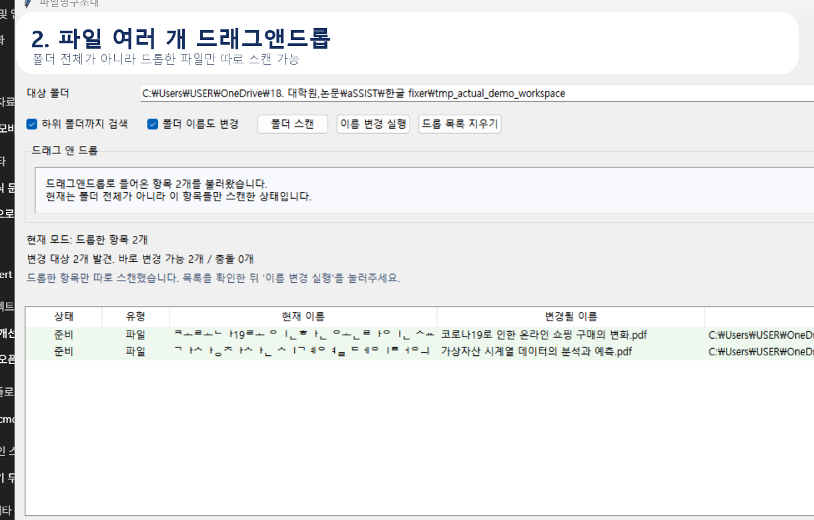
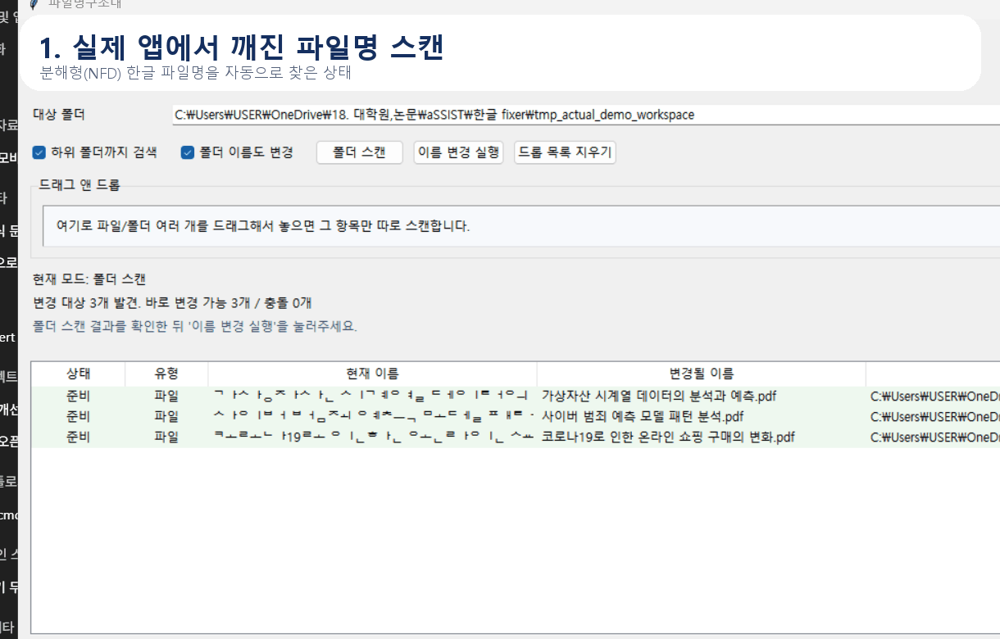

# 파일명구조대

깨진 한글 파일명을 원래 읽히는 형태로 복구하는 Windows 유틸리티입니다.

`코로나19로.pdf` 같은 자모 분리 파일명을 `코로나19로.pdf`처럼 정상 한글 이름으로 바꿔줍니다.

## 실제 데모

실제 앱 화면 기준 데모입니다.





추가 이미지:

- 스캔 화면: [actual_scan.png](output/actual_demo/actual_scan.png)
- 드래그앤드롭 화면: [actual_drop_mode.png](output/actual_demo/actual_drop_mode.png)
- 변경 후 화면: [actual_after.png](output/actual_demo/actual_after.png)
- 데모 영상: [actual_demo.mp4](output/actual_demo/actual_demo.mp4)

## 왜 만들었나

이 문제는 생각보다 자주 생깁니다.

- macOS/Linux에서 만든 파일을 Windows로 옮겼을 때
- OneDrive, 메신저, 압축 프로그램, 클라우드 저장소를 거쳤을 때
- 어떤 앱은 한글 정규화(`NFC`)를 자동으로 맞춰 보여주지 못할 때

겉으로는 “글자가 깨졌다”처럼 보이지만, 실제로는 파일명이 분해형 유니코드(`NFD`)로 저장된 경우가 많습니다.

파일명구조대는 이 문제를 스캔하고, 바뀔 이름을 미리 보여주고, 충돌을 확인한 뒤 안전하게 일괄 변경합니다.

## 핵심 기능

- 깨진 한글 파일명 자동 탐지
- 변경될 이름 미리보기
- 파일 여러 개 드래그앤드롭
- 폴더 드래그앤드롭
- 하위 폴더까지 일괄 스캔
- 파일과 폴더 이름 모두 변경 가능
- 이름 충돌 자동 감지
- 실행 로그 JSON 저장

## 사용 방법

### 1. 실행

- `run_hangul_filename_fixer.bat` 더블클릭

또는

```powershell
py -3 .\hangul_filename_fixer.py
```

### 2. 대상 선택

둘 중 하나를 고르면 됩니다.

- 폴더를 선택한 뒤 `폴더 스캔`
- 파일/폴더 여러 개를 창 안으로 드래그앤드롭

### 3. 미리보기 확인

- 현재 이름
- 변경될 이름
- 충돌 여부

를 표에서 바로 확인할 수 있습니다.

### 4. 실행

- `이름 변경 실행` 버튼 클릭

변경 결과는 JSON 로그로 저장됩니다.

## 이런 분들께 유용합니다

- 학교 과제/논문 자료를 많이 다루는 학생
- PDF, PPTX, DOCX를 자주 주고받는 직장인
- 맥과 윈도우를 함께 쓰는 사용자
- OneDrive/구글드라이브/압축파일 때문에 파일명이 깨진 사람
- 고객 PC 문제를 원격으로 자주 해결해주는 IT 지원 담당자

## 신뢰 원칙

- 파일 내용을 읽지 않습니다
- 파일 이름만 변경합니다
- 변경 전 목록을 먼저 보여줍니다
- 충돌 항목은 자동으로 건너뜁니다
- 실행 로그를 남겨 추적할 수 있습니다

## 앞으로 붙이면 좋은 기능

- 실행 취소(Undo)
- 우클릭 메뉴 통합
- 특정 폴더 자동 감시
- 자주 깨지는 다른 언어/문자셋 복구
- exe 패키징 및 자동 업데이트

## 배포 추천

이 프로젝트는 `GitHub`를 본진으로 두고, 블로그는 검색 유입과 사례 소개용으로 운영하는 구성이 좋습니다.

- GitHub: 소스 공개, 다운로드, 이슈 제보, 릴리즈 배포
- 블로그: 사용 사례, 전후 비교 이미지, 검색 유입, 후기 축적

## 후원 / 문의

처음에는 무료 공개 후 후원 링크를 붙이는 전략을 추천합니다.

- GitHub Sponsors
- Buy Me a Coffee
- Toss 후원 링크

기업/학교용 배포판이나 자동복구 기능이 붙으면 이후 Pro 버전으로 분리할 수 있습니다.

---

브랜드명은 `파일명구조대`, 검색용 설명 문구는 `깨진 한글 파일명 복구기` 조합을 추천합니다.
